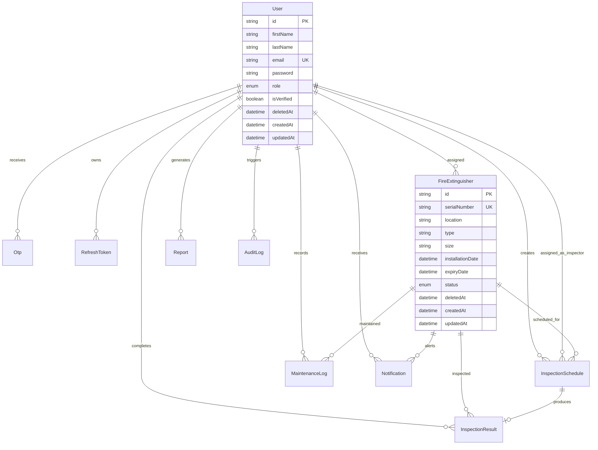

# Fire Extinguisher Management System ERD

```mermaid
erDiagram
  User ||--o{ Otp : receives
  User ||--o{ RefreshToken : owns
  User ||--o{ FireExtinguisher : assigned
  User ||--o{ InspectionSchedule : creates
  User ||--o{ InspectionSchedule : assigned_as_inspector
  User ||--o{ InspectionResult : completes
  User ||--o{ MaintenanceLog : records
  User ||--o{ Notification : receives
  User ||--o{ Report : generates
  User ||--o{ AuditLog : triggers

  FireExtinguisher ||--o{ InspectionSchedule : scheduled_for
  FireExtinguisher ||--o{ InspectionResult : inspected
  FireExtinguisher ||--o{ MaintenanceLog : maintained
  FireExtinguisher ||--o{ Notification : alerts

  InspectionSchedule ||--o| InspectionResult : produces

  User {
    string id PK
    string firstName
    string lastName
    string email UK
    string password
    enum role
    boolean isVerified
    datetime deletedAt
    datetime createdAt
    datetime updatedAt
  }

  FireExtinguisher {
    string id PK
    string serialNumber UK
    string location
    string type
    string size
    datetime installationDate
    datetime expiryDate
    enum status
    datetime deletedAt
    datetime createdAt
    datetime updatedAt
  }
```
